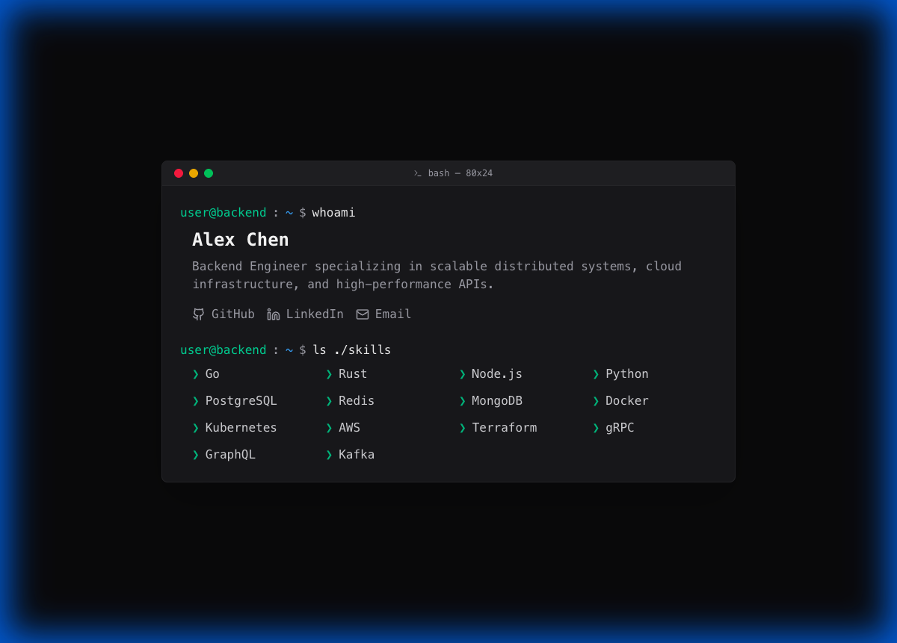
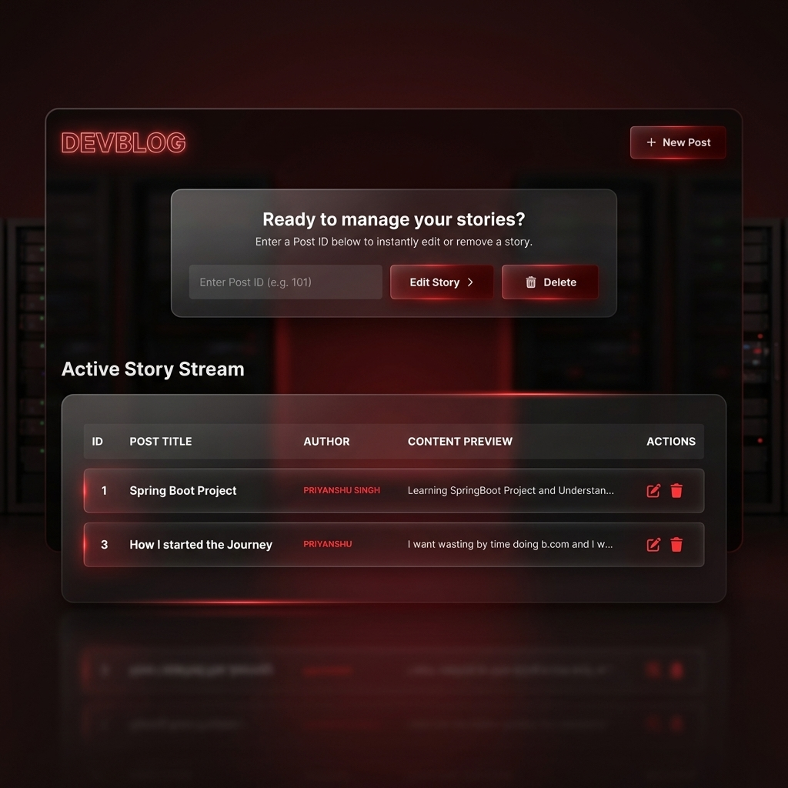
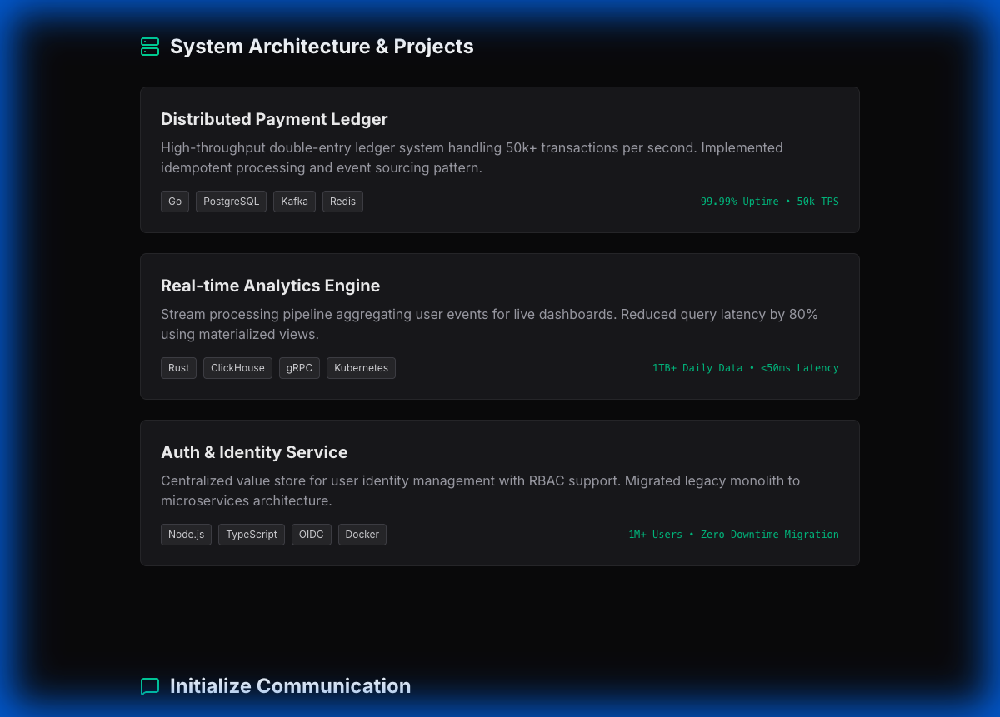
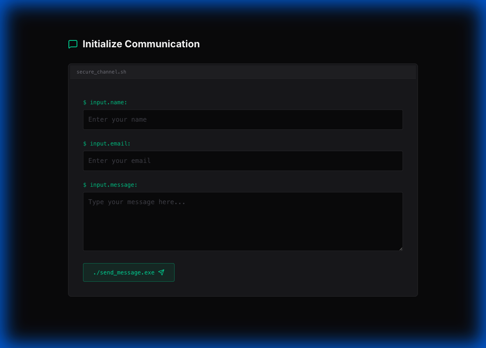

# Priyanshu - Backend Developer Portfolio



A professional, high-performance portfolio website designed for Backend Developers. Built with **React**, **Tailwind CSS**, and **Framer Motion**, featuring a modern dark-themed UI that developers love.

## 🚀 Features

- **Terminal-Inspired Design**: Dark mode aesthetic with code-like visual elements.
- **Interactive UI**: Smooth animations and transitions using Framer Motion.
- **Responsive Layout**: Fully optimized for Desktop, Tablet, and Mobile devices.
- **Project Showcase**: Grid layout to display backend architectures, APIs, and systems.
- **Skills Matrix**: Categorized tech stack display.
- **Contact Form**: Functional design for potential clients or recruiters.

## 🛠 Tech Stack

- **Frontend**: React (Vite)
- **Styling**: Tailwind CSS (v3)
- **Icons**: Lucide React
- **Animations**: Framer Motion

### Backend Technologies Highlighted
- **Languages**: Java, Python
- **Frameworks**: Spring Boot, Express.js
- **Databases**: MySQL, MongoDB, Redis
- **DevOps**: Docker, Kubernetes, AWS
- **Other**: Servlet/JSP

## 🎬 Featured Project: Netflix-Style Blogging Platform



A premium, cinematic full-stack blogging web application built with **Spring Boot** and **Thymeleaf**. This project features a high-end UI/UX inspired by the Netflix interface, complete with glassmorphism, cinematic typography, and smooth micro-animations.

### 🚀 Key Features
- **Cinematic UI/UX**: Professional Netflix-inspired dark theme with custom CSS variables.
- **Glassmorphic Components**: High-end blur effects and translucent borders.
- **Action Dashboard**: Manage stories instantly by ID with a custom cinematic search-style interface.
- **Full CRUD Operations**: Robust backend system for managing blog posts.
- **MVC Architecture**: Clean separation of concerns (Controller, Service, Repository, Model).

### 🛠 Project Tech Stack
- **Backend**: Java 21, Spring Boot
- **Database**: MySQL (with Spring Data JPA / Hibernate)
- **Frontend**: Thymeleaf, Bootstrap 5, Vanilla CSS
- **Build Tool**: Maven

## 📸 Screenshots

### Projects Section


### Contact Section


## 🏃‍♂️ How to Run Locally

1. **Clone the repository**
   ```bash
   git clone https://github.com/yourusername/backend-portfolio.git
   cd backend-portfolio
   ```

2. **Install Dependencies**
   ```bash
   npm install
   ```

3. **Start the Development Server**
   ```bash
   npm run dev
   ```

## 🎨 Customization

You can easily customize the colors in `tailwind.config.js`:

```javascript
colors: {
  primary: "#0F172A", // Background
  secondary: "#1E293B", // Cards
  accent: "#38BDF8", // Highlights
}
```

## 📄 License

MIT License © 2025 Priyanshu Singh
